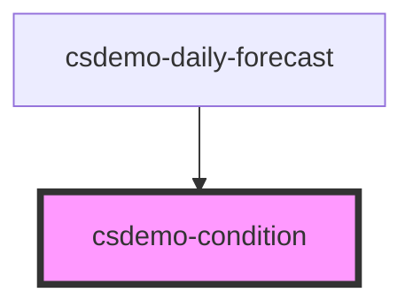

# csdemo-condition

## Styling

| Custom Property                      | Description
| ------------------------------------ | -------------------------------------------------------------------------------------------------------------------------------------------------------------------------- |
| --csdemo-condition-image-height      | The height to use for the image portion of the condition.
| --csdemo-condition-label-font-size   | The font size used for the condition label.
| --csdemo-condition-label-font-weight | The font weight used for the condition label.

All styling is optional. If not specified, the system default styling is used.

<!-- Auto Generated Below -->

## Properties

| Property    | Attribute   | Description                                                                                                       | Type                 | Default     |
| ----------- | ----------- | ----------------------------------------------------------------------------------------------------------------- | -------------------- | ----------- |
| `condition` | `condition` | The overall weather condition as defined by the OpenWeatherMap API. https://openweathermap.org/weather-conditions | `number`             | `undefined` |
| `iconPaths` | --          | Override the default icon paths. If the default icon names that we have are used and put in `assets/images`.      | `ConditionIconPaths` | `undefined` |
| `noIcon`    | `no-icon`   | Specify that the icon / image for the condition should not be displayed                                           | `boolean`            | `undefined` |
| `noLabel`   | `no-label`  | Specify that the label for the condition should not be displayed                                                  | `boolean`            | `undefined` |

## Dependencies

### Used by

 - [csdemo-daily-forecast](../csdemo-daily-forecast)

### Graph

----------------------------------------------

*Built with [StencilJS](https://stenciljs.com/)*
