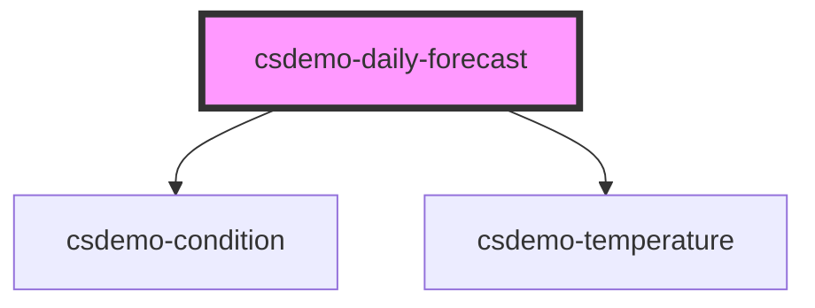

# csdemo-daily-forecast

## Styling

| Custom Property                                    | Description
| -------------------------------------------------- | -------------------------------------------------------------------------------------------------------------------------------------------------------------------------- |
| --csdemo-daily-forecast-description-font-size      | Font sized used for the descriptive text section of the component.
| --csdemo-daily-forecast-description-font-weight    | Font weight used for the descriptive text section of the component.
| --csdemo-daily-forecast-description-padding-left   | Left side padding for the descriptive text area.
| --csdemo-daily-forecast-description-padding-right  | Right side padding for the descriptive text area.
| --csdemo-daily-forecast-description-padding-top    | Top padding for the descriptive text area.
| --csdemo-daily-forecast-description-padding-bottom | Bottom padding for the descriptive text area.
| --csdemo-daily-forecast-description-min-width      | Minimum width for the descriptive test area. Aids in keeping a consistent size when multiple forecasts are displayed together in a list.
| --csdemo-daily-forecast-date-font-size             | Override the font size for the date portion of the descriptive text section. Otherwise `--csdemo-daily-forecast-description-font-size` is used.
| --csdemo-daily-forecast-date-font-weight           | Override the font weight for the date portion of the descriptive text section. Otherwise `--csdemo-daily-forecast-description-font-weight` is used.
| --csdemo-daily-forecast-image-height               | The height to use for the image section of the forecast.

All styling is optional. If not specified, the system default styling is used.

<!-- Auto Generated Below -->

## Properties

| Property    | Attribute | Description                                                                                                                                                  | Type                 | Default     |
| ----------- | --------- | ------------------------------------------------------------------------------------------------------------------------------------------------------------ | -------------------- | ----------- |
| `forecast`  | --        | The forecast to display information about.                                                                                                                   | `Forecast`           | `undefined` |
| `iconPaths` | --        | Override the default icon paths. If the default icon names that we have are used and put in `assets/images`.                                                 | `ConditionIconPaths` | `undefined` |
| `scale`     | `scale`   | The temperature in the forecast is specified in Kelvin. The scale specifies the units to display the temperature in, 'C' for Celsius and 'F' for Fahrenheit. | `string`             | `undefined` |

## Dependencies

### Depends on

- [csdemo-condition](../csdemo-condition)
- [csdemo-temperature](../csdemo-temperature)

### Graph

----------------------------------------------

*Built with [StencilJS](https://stenciljs.com/)*
