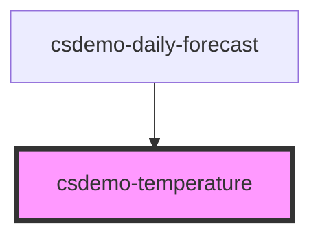

# csdemo-temperature

<!-- Auto Generated Below -->

## Properties

| Property      | Attribute     | Description                                                                                                                                  | Type     | Default     |
| ------------- | ------------- | -------------------------------------------------------------------------------------------------------------------------------------------- | -------- | ----------- |
| `scale`       | `scale`       | The temperature is specified in Kelvin. The scale specifies the units to display the temperature in, 'C' for Celsius and 'F' for Fahrenheit. | `string` | `undefined` |
| `temperature` | `temperature` | The temperature specified in Kelvin.                                                                                                         | `number` | `undefined` |

## Events

| Event          | Description                                          | Type                                        |
| -------------- | ---------------------------------------------------- | ------------------------------------------- |
| `csdemoChange` | Emitted when the value temperature value is changed. | `CustomEvent<TemperatureChangeEventDetail>` |

## Dependencies

### Used by

 - [csdemo-daily-forecast](../csdemo-daily-forecast)

### Graph

----------------------------------------------

*Built with [StencilJS](https://stenciljs.com/)*
